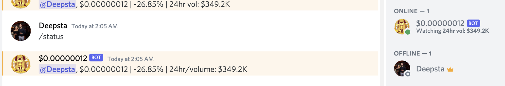

# Discord crypto bot 🚀

This bot will update its status message with the current price of the desired cryptocurrency.

v1

## How to use

This bot is really easy to use.

Just follow these steps:
1. Have [Node.JS](https://nodejs.org) installed.
2. Clone this repository to a folder on your computer.
3. Open a terminal in that folder, and install the packages with `npm install`
4. Open the `.env-template` file and configure it to your liking.

## Extra Info

This was created for my Discord server, but I wanted to share it with added flexibility for anyone to use.
This relies on the API hosted at https://api.coingecko.com
## future plan

Backup exchange to be pancake swap for smaller tokens.